# CFS-Crafter Citation
Wang, G., Alais, D., Blake, R. et al. CFS-crafter: An open-source tool for creating and analyzing images for continuous flash suppression experiments. Behav Res (2022). https://doi.org/10.3758/s13428-022-01903-7

# Online Documentation:** [https://guandongwang.github.io/cfs_crafter/](https://guandongwang.github.io/cfs_crafter/)

# CFS-Crafter Help Information  

**CFS-Crafter** is an open-source MATLAB application designed for precise control, manipulation, and analysis of CFS stimuli. The application does not require prior expertise in image processing and analysis, making it an accessible tool for improving stimulus control, enhancing comprehension of CFS findings, and generating more effective CFS animations.  

---

## Table of Contents
- [Examples Library](#examples-library)
- [1. Screen Information](#1-screen-information)
- [2. Choose Function](#2-choose-function)
  - [2.1. Creation](https://guandongwang.github.io/cfs_crafter/Creation.html)
  - [2.2. Conversion](https://guandongwang.github.io/cfs_crafter/Conversion.html)
  - [2.3. Modification](https://guandongwang.github.io/cfs_crafter/Modification.html)
  - [2.4. Analysis](https://guandongwang.github.io/cfs_crafter/Analysis.html)

---

## Examples Library

### Animated Examples
<table align="center">
  <tr>
    <td align="center">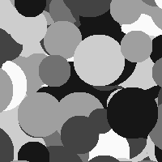 <b>Grayscale Mondrian</b></td>
    <td align="center">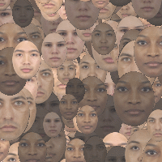 <b>Traced Face Pattern</b></td>
    <td align="center">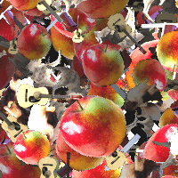 <b>Traced Object Pattern</b></td>
    <td align="center">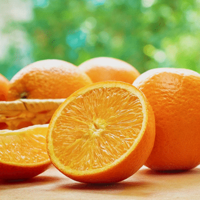 <b>Image Sequence</b></td>
  </tr>
  <tr>
    <td align="center">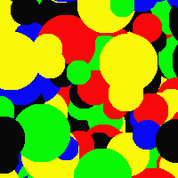 <b>Before Filtering</b></td>
    <td align="center">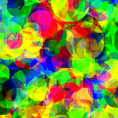 <b>Temporal Filtering</b></td>
    <td align="center">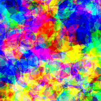 <b>Bandpass Temporal</b></td>
    <td align="center">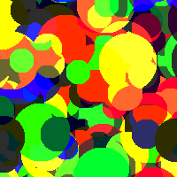 <b>High-Pass Temporal</b></td>
  </tr>
</table>

### Static Examples
<table align="center">
  <tr>
    <td align="center">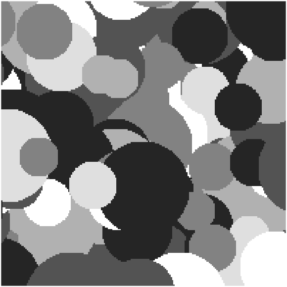 <b>Circle Mondrian</b></td>
    <td align="center">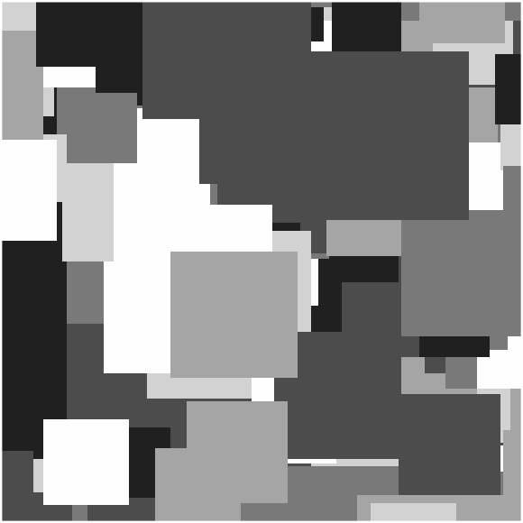 <b>Square Mondrian</b></td>
    <td align="center">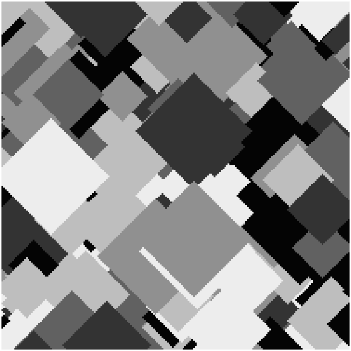 <b>Diamond Mondrian</b></td>
    <td align="center">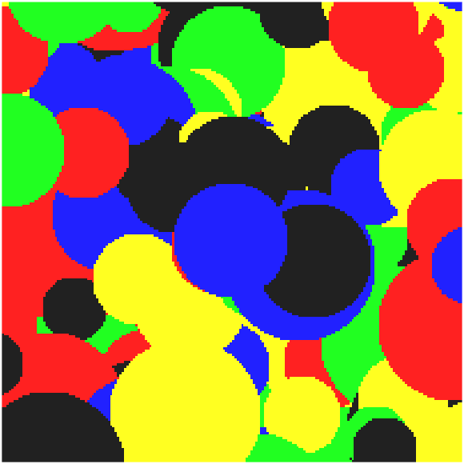 <b>RGB Mondrian</b></td>
  </tr>
  <tr>
    <td align="center">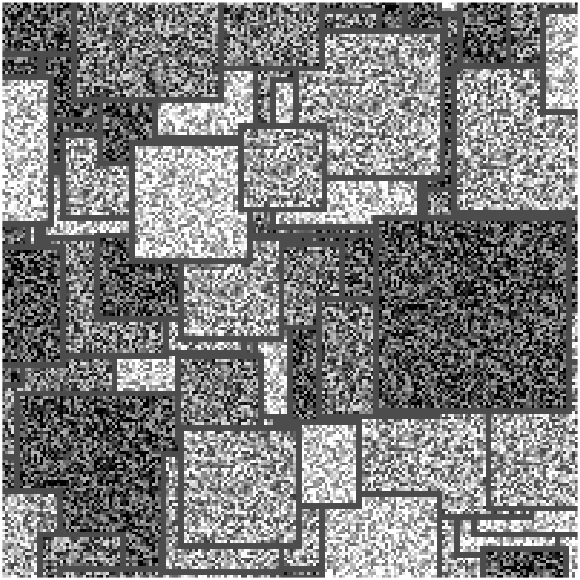 <b>White Noise Fill</b></td>
    <td align="center">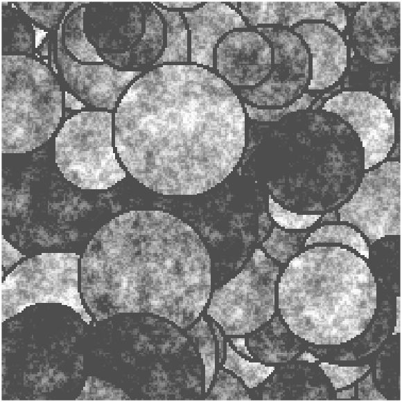 <b>Pink Noise Fill</b></td>
    <td align="center">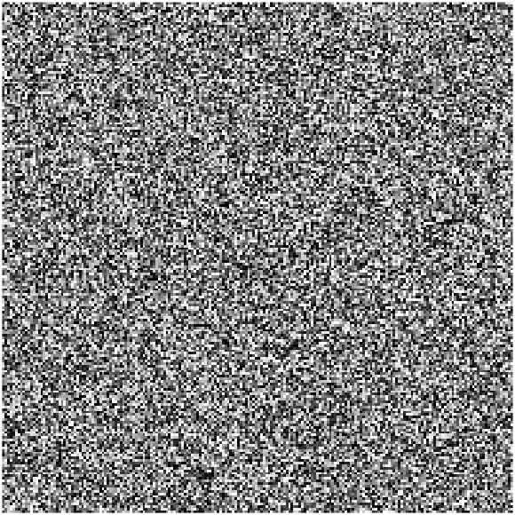 <b>White Noise Mask</b></td>
    <td align="center">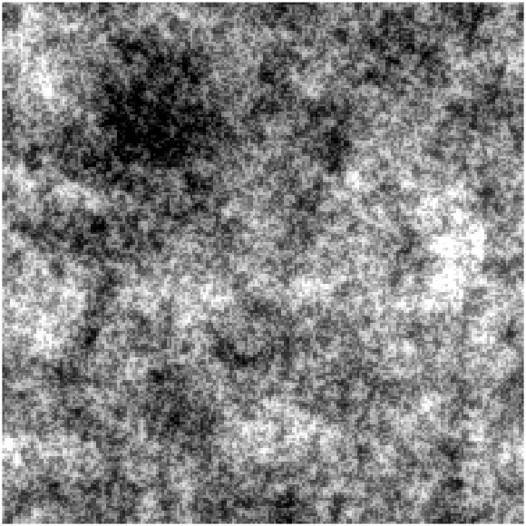 <b>Pink Noise Mask</b></td>
  </tr>
  <tr>
    <td align="center">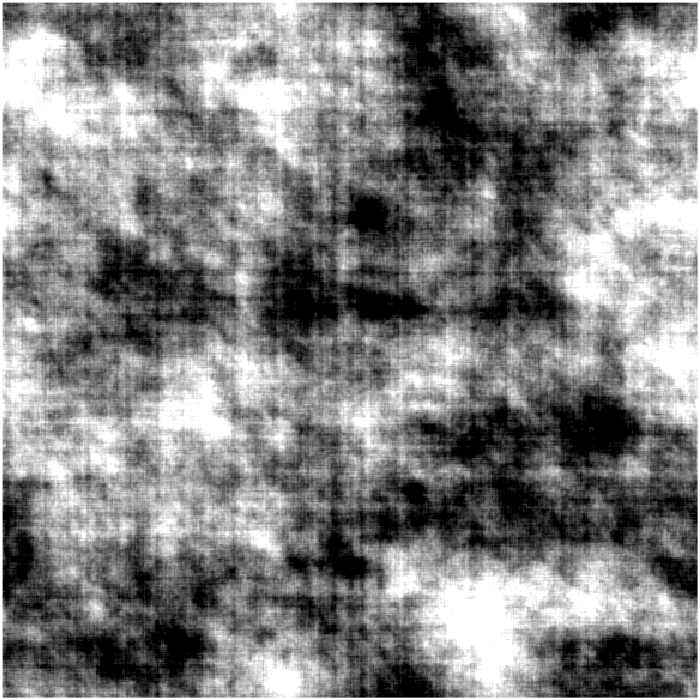 <b>Full Freq Scramble</b></td>
    <td align="center">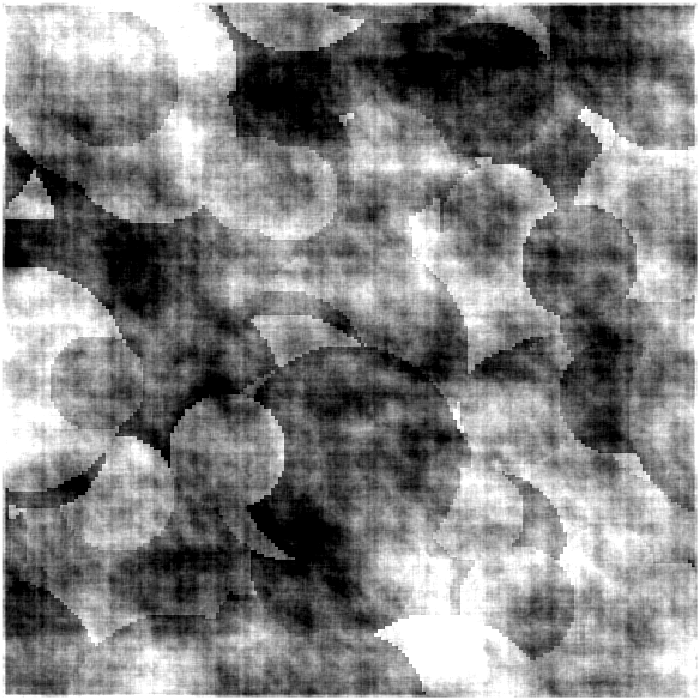 <b>Partial Scramble</b></td>
    <td align="center">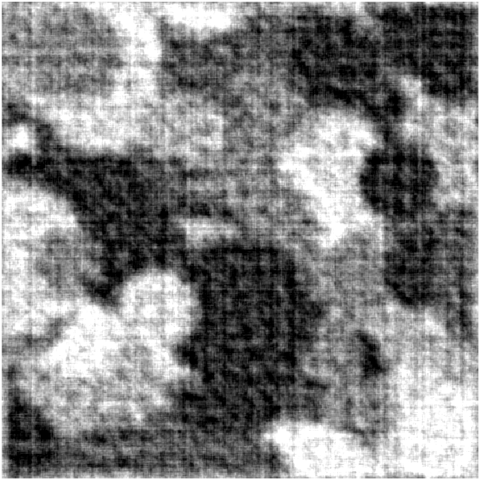 <b>High Freq Scramble</b></td>
    <td align="center">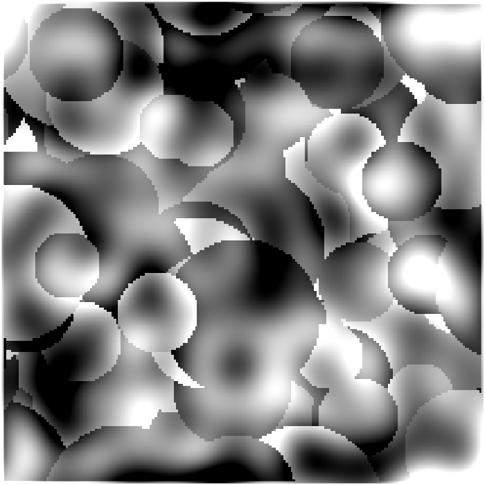 <b>Low Freq Scramble</b></td>
  </tr>
  <tr>
    <td align="center">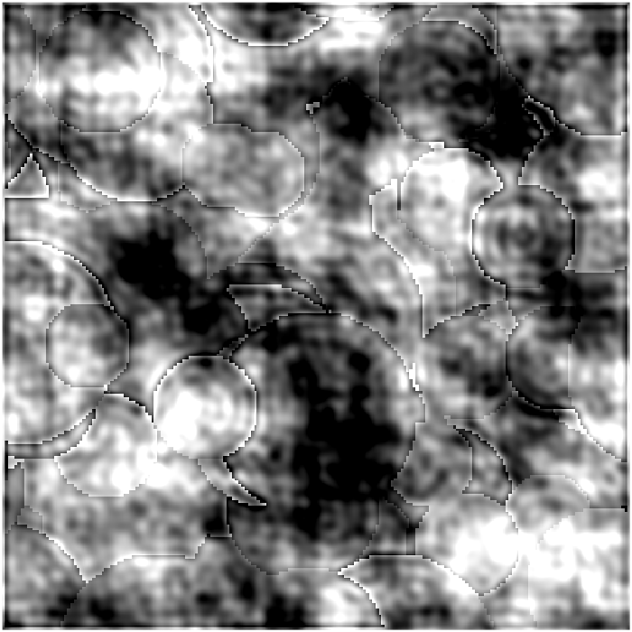 <b>Bandpass Scramble</b></td>
    <td align="center">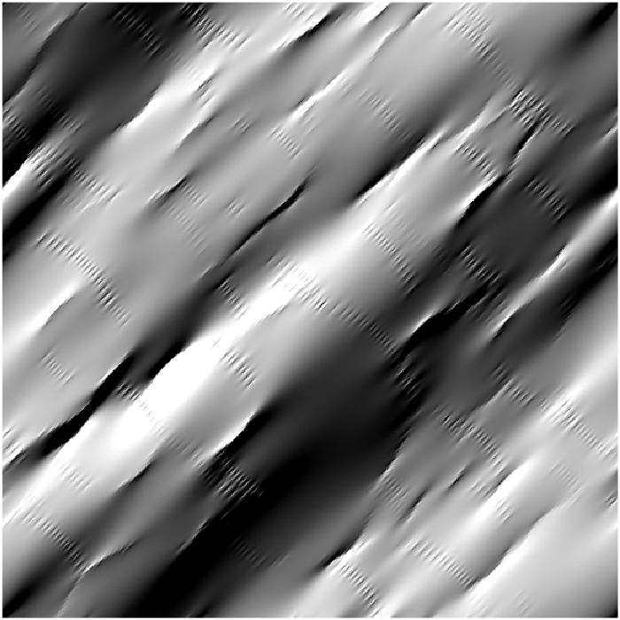 <b>Orientation Filtered</b></td>
    <td align="center">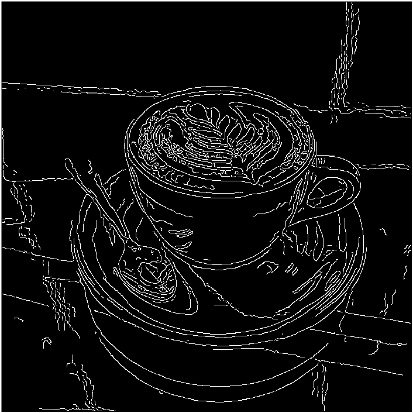 <b>Edge Detection</b></td>
    <td align="center"></td>
  </tr>
</table>

---

## 1. Screen Information  

Users must manually enter the screen details for stimulus presentation. This information is essential for calculating key parameters. The user cannot proceed to the next step without completing all required fields.  

### 1.1. Screen Refresh Rate (Hz)  

The *screen refresh rate* should match the refresh rate of the display used for stimulus presentation. An incorrect value may cause errors in frame rate and other temporal properties.  

### 1.2. Viewing Distance (cm)  

The *viewing distance* is the distance between the participant’s eyes and the screen during the experiment. Incorrect values may lead to errors in calculations related to the degree of visual angle.  

### 1.3. Screen Resolution (pixels) & Screen Dimensions (cm)  

**CFS-Crafter** automatically detects the *screen resolution* and *dimensions* of the current display and sets them as default values. If the stimuli will be used on a different screen, these values must be updated manually. Incorrect information may cause errors in spatial frequency and other spatial properties.  

---

## 2. Choose Function  

### 2.1. [Creation](https://guandongwang.github.io/cfs_crafter/Creation.html)  

  

The **Creation** function allows users to generate various types of *CFS-Crafter Masks*, which can be saved as `.mat` files with metadata or exported as `.mp4` video files.  

- **[Traced Pattern](https://guandongwang.github.io/cfs_crafter/Trace.html)**  

    

  Details about *traced item patterned masks* in **Creation**.  

- **[Stimuli Preview](https://guandongwang.github.io/cfs_crafter/Preview.html)**  

  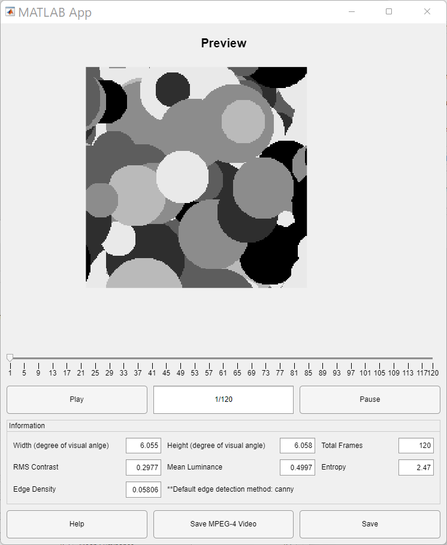  

  Details about previewing & saving *CFS-Crafter Masks* & *Images*.  

### 2.2. [Conversion](https://guandongwang.github.io/cfs_crafter/Conversion.html)  

  

The **Conversion** function allows users to transform a set of images into a *CFS-Crafter Mask*, enabling further modification or analysis.  

### 2.3. [Modification](https://guandongwang.github.io/cfs_crafter/Modification.html)  

  

The **Modification** function applies spatial, temporal, and orientation filtering, as well as phase scrambling, to *CFS-Crafter Masks* or *Images*.  

### 2.4. [Analysis](https://guandongwang.github.io/cfs_crafter/Analysis.html)  

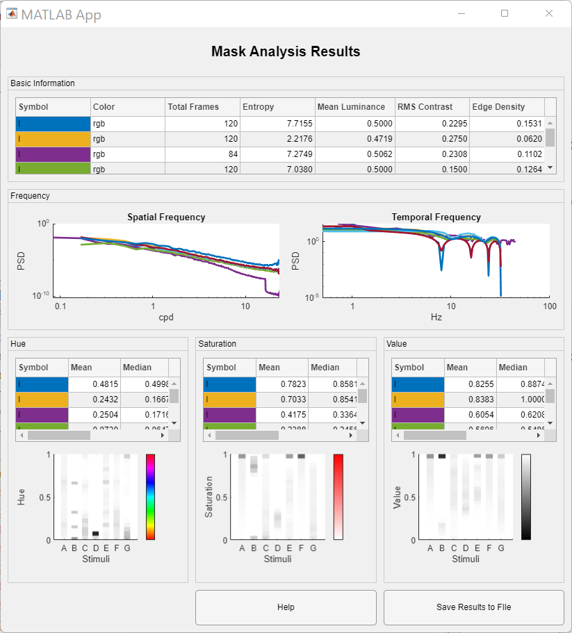  

The **Analysis** function provides tools for analyzing and comparing descriptive statistics, spatiotemporal frequencies, and color content of multiple stimuli (*CFS-Crafter Masks* or *Images*).  

- **[Edge Detection](https://guandongwang.github.io/cfs_crafter/Edge_preview.html)**  

    

  Details about edge detection in **Analysis**.
